<h2><a href= "https://www.mackenzie.br">Universidade Presbiteriana Mackenzie</a></h2>
<h3><a href= "https://www.mackenzie.br/graduacao/sao-paulo-higienopolis/sistemas-de-informacao">Sistemas de Informação</a></h3>

_&lt;Sistema Falcão Sombrio&gt;_

**Conteúdo**

- [Autores](#autores)
- [Descrição do Projeto](#descrição-do-projeto)
- [Análise de Requisitos Funcionais e Não-Funcionais](#análise-de-requisitos-funcionais-e-não-funcionais)
- [Diagrama de Atividades](#diagrama-de-atividades)
- [Diagrama de Casos de Uso](#diagrama-de-casos-de-uso)
- [Descrição dos Casos de Uso](#descrição-dos-casos-de-uso)
- [Diagrama de Sequência](#diagrama-de-sequência)
- [Diagrama de Classes](#diagrama-de-classes)
- [Diagrama de Estados](#diagrama-de-estados)
- [Diagrama de Implantação](#diagrama-de-implantação)
- [Referências](#referências)

# Autores

- Matheus Gabriel Viana Araujo - 10420444
- Gustavo Pupke - 10426316
- Guilherme Araujo Castro - 10427775

# Descrição do Projeto

_&lt;Introdução do projeto&gt;_

# Análise de Requisitos Funcionais e Não-Funcionais

## Requisitos Funcionais

| ID    | Título                         | Descrição                                                                                                                                        |
| ----- | ------------------------------ | ------------------------------------------------------------------------------------------------------------------------------------------------ |
| RF-01 | Painel de Controle Unificado   | Fornecer painel GUI centralizado para monitoramento em tempo real da telemetria de drones e controle remoto/autônomo.                            |
| RF-02 | Sensoriamento Ambiental        | Integrar sensores para percepção espacial 3D e detecção de obstáculos/ameaças. Drones devem desviar autonomamente, planejando rotas seguras.     |
| RF-03 | Navegação Autônoma Inteligente | Permitir planejamento de missões autônomas via mapa interativo. Navegação baseada em IA para otimização de rotas e adaptação em tempo real.      |
| RF-04 | Fallback Automático de Falhas  | Implementar mecanismos de fallback em caso de perda de conexão. Sistema deve tentar restabelecer conexão automaticamente.                        |
| RF-05 | Logging de Missões             | Registrar logs detalhados de missões e logs de auditoria imutáveis para rastreabilidade e conformidade.                                          |
| RF-06 | Monitoramento de Atividades    | Autenticar operadores com MFA. Monitorar e registrar atividades de operadores e do sistema para segurança e responsabilidade.                    |
| RF-07 | Gerenciamento Remoto           | Permitir gerenciamento e implantação remota e segura de atualizações de software/firmware nos drones, com verificação de integridade e rollback. |

## Requisitos Não Funcionais

| ID    | Título                             | Descrição                                                                                                                                                   |
| ----- | ---------------------------------- | ----------------------------------------------------------------------------------------------------------------------------------------------------------- |
| RN-01 | Desempenho em Tempo Real           | Garantir comunicação em tempo real e painel de telemetria com alta taxa de atualização.                                                                     |
| RN-02 | Segurança Robusta                  | Implementar criptografia de ponta a ponta para comunicação e dados. Proteger contra ataques cibernéticos e dados sensíveis.                                 |
| RN-03 | Escalabilidade                     | Arquitetura escalável horizontalmente para suportar grande número de drones e operadores sem perda de desempenho.                                           |
| RN-04 | Interface Intuitiva                | Interface GUI intuitiva, fácil de usar e otimizada para operações críticas. Design centrado no usuário e responsiva a diferentes dispositivos.              |
| RN-05 | Failover Automático                | Sistema com alta disponibilidade e failover automático para garantir continuidade operacional em caso de falhas.                                            |
| RN-06 | Armazenamento de Dados Distribuído | Banco de dados distribuído, replicado geograficamente e com mecanismos de backup/recuperação para alta durabilidade e integridade dos dados.                |
| RN-07 | Conformidade Regulatória           | Sistema em conformidade com normas de operação de drones e padrões de segurança cibernética.                                                                |
| RN-08 | Eficiência Energética              | Drones com design focado em eficiência energética e algoritmos de IA para otimizar consumo de bateria.                                                      |
| RN-09 | Facilidade de Manutenção           | Sistema projetado para facilitar manutenção, monitoramento e diagnóstico de problemas, com ferramentas e alertas proativos.                                 |
| RN-10 | Confiabilidade de Drones           | Drones e componentes projetados para alta confiabilidade e durabilidade em ambientes operacionais exigentes, com testes rigorosos e monitoramento de saúde. |

# Diagrama de Atividades

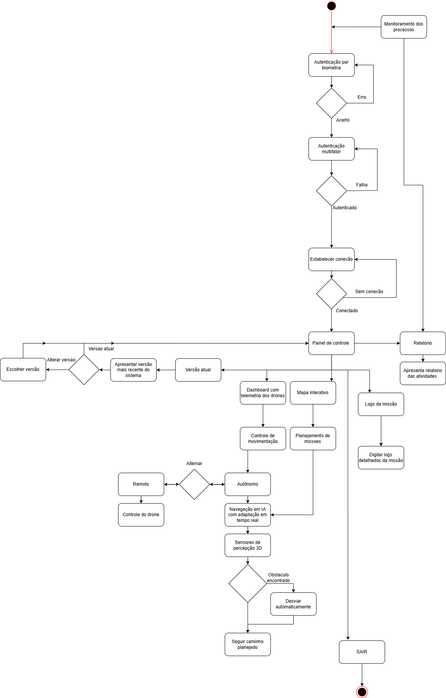

# Diagrama de Casos de Uso

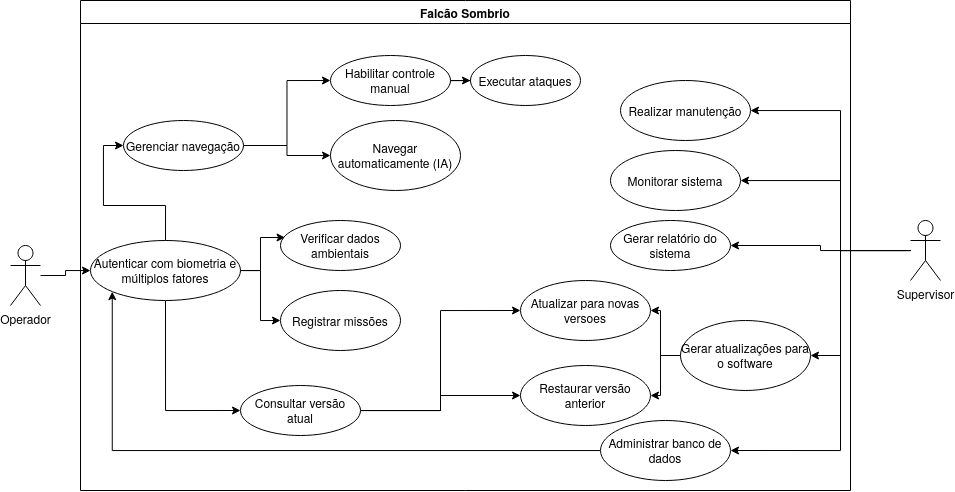

# Descrição dos Casos de Uso

| Nome do Caso de Uso     | Autenticar com biometria e múltiplos fatores                                                                                                                                                                                                                                                                                                                                                                                             |
| ----------------------- | ---------------------------------------------------------------------------------------------------------------------------------------------------------------------------------------------------------------------------------------------------------------------------------------------------------------------------------------------------------------------------------------------------------------------------------------- |
| Ator Principal          | Operador                                                                                                                                                                                                                                                                                                                                                                                                                                 |
| Atores Secundários      | Nenhum                                                                                                                                                                                                                                                                                                                                                                                                                                   |
| Resumo                  | Operador se autentica no sistema Falcão Sombrio utilizando biometria e múltiplos fatores para acesso.                                                                                                                                                                                                                                                                                                                                    |
| Pré-condições           | Operador possui conta no sistema. Sistema Falcão Sombrio está disponível. Dados biométricos do operador registrados. Dispositivo de autenticação multifator configurado.                                                                                                                                                                                                                                                                 |
| Pós-condições           | Operador está autenticado e tem acesso às funcionalidades do sistema.                                                                                                                                                                                                                                                                                                                                                                    |
| **FLUXO PRINCIPAL**     |                                                                                                                                                                                                                                                                                                                                                                                                                                          |
| Ações do Ator           | 2. Operador fornece dados biométricos. 5. Operador fornece código de autenticação multifator do seu dispositivo.                                                                                                                                                                                                                                                                                                                         |
| Ações do Sistema        | 1. Sistema Falcão Sombrio solicita autenticação do Operador. 3. Sistema de autenticação Biométrica verifica dados biométricos com o registro. 4. Se a verificação biométrica for bem-sucedida, o Sistema Falcão Sombrio solicita autenticação multifator. 6. Sistema de autenticação Multifator verifica o código de autenticação. 7. Se a verificação multifator for bem-sucedida, o Sistema Falcão Sombrio concede acesso ao Operador. |
| **FLUXOS ALTERNATIVOS** | Dados biométricos incorretos fornecidos: Sistema exibe mensagem de erro e solicita nova autenticação. autenticação multifator falha: sistema exibe mensagem de erro e solicita nova autenticação.                                                                                                                                                                                                                                        |
| **FLUXOS DE EXCEÇÃO**   | Sistema de autenticação biométrica indisponível: sistema exibe mensagem de erro ao Operador e aborta o processo de autenticação. Sistema de autenticação multifator indisponível: Sistema exibe mensagem de erro ao Operador e aborta o processo de autenticação.                                                                                                                                                                        |
| Restrições e Validações | O tempo para autenticação completa não pode exceder 30 segundos. Após 3 tentativas incorretas de autenticação, a conta do operador é bloqueada.                                                                                                                                                                                                                                                                                          |

| Nome do Caso de Uso     | Gerenciar Navegação                                                                                                                                                                                                                                                                                                                                                                                                                                            |
| ----------------------- | -------------------------------------------------------------------------------------------------------------------------------------------------------------------------------------------------------------------------------------------------------------------------------------------------------------------------------------------------------------------------------------------------------------------------------------------------------------- |
| Ator Principal          | Operador                                                                                                                                                                                                                                                                                                                                                                                                                                                       |
| Atores Secundários      | Supervisor                                                                                                                                                                                                                                                                                                                                                                                                                                                     |
| Resumo                  | Sistema de Navegação Inteligente gerencia a rota dos drones, detecta e evita obstáculos, e responde a eventos inesperados para garantir uma navegação segura e eficiente.                                                                                                                                                                                                                                                                                      |
| Pré-condições           | Drones estão operacionais e conectados ao Sistema Falcão Sombrio. Sistema de Navegação Inteligente está ativo e possui informações atualizadas do ambiente.                                                                                                                                                                                                                                                                                                    |
| Pós-condições           | Drones navegam com segurança e eficiência, adaptando-se a condições dinâmicas e imprevistos.                                                                                                                                                                                                                                                                                                                                                                   |
| **FLUXO PRINCIPAL**     |                                                                                                                                                                                                                                                                                                                                                                                                                                                                |
| Ações do Ator           |                                                                                                                                                                                                                                                                                                                                                                                                                                                                |
| Ações do Sistema        | 1. Sistema de Navegação Inteligente recebe dados do ambiente (LIDAR, câmeras, GPS). 2. Sistema detecta obstáculos (outros drones, edifícios, etc.) e define rota ideal. 3. Sistema envia comandos de direção aos drones. 4. Sistema monitora a rota e o ambiente em tempo real. 5. Se uma ameaça for detectada, Sistema calcula e envia rota de evasão. 6. Se comunicação com a Central de Controle for perdida, Sistema ativa protocolo de operação autônoma. |
| **FLUXOS ALTERNATIVOS** | Obstáculo detectado: Sistema calcula e envia nova rota, evitando o obstáculo. Ameaça detectada: Sistema calcula e envia rota de evasão. Condições climáticas adversas: Sistema adapta rota para garantir segurança.                                                                                                                                                                                                                                            |
| **FLUXOS DE EXCEÇÃO**   | Falha de sensor: Sistema utiliza dados de outros sensores para continuar navegação. Perda de comunicação com drone: Sistema ativa protocolo de retorno à base ou pouso de emergência (dependendo da situação).                                                                                                                                                                                                                                                 |
| Restrições e Validações | Tempo de resposta para detecção de obstáculos e cálculo de rotas alternativas não pode exceder 100ms.                                                                                                                                                                                                                                                                                                                                                          |

| Nome do Caso de Uso     | Habilitar Controle Manual                                                                                                                      |
| ----------------------- | ---------------------------------------------------------------------------------------------------------------------------------------------- |
| Ator Principal          | Operador                                                                                                                                       |
| Atores Secundários      | Nenhum                                                                                                                                         |
| Resumo                  | O Operador alterna o drone do modo autônomo para o controle manual, assumindo a direção direta das operações.                                  |
| Pré-condições           | Operador autenticado. Drone em modo autônomo. Sistema operacional estável.                                                                     |
| Pós-condições           | Drone em modo manual. Controles manuais habilitados no painel do Operador.                                                                     |
| **FLUXO PRINCIPAL**     |                                                                                                                                                |
| Ações do Ator           | 1. Operador seleciona "Controle Manual" no painel de controle. 3. Operador confirma a mudança de modo.                                         |
| Ações do Sistema        | 2. Sistema verifica a conexão de comunicação com o drone. 4. Sistema desativa a IA de navegação e libera os controles manuais para o Operador. |
| **FLUXOS ALTERNATIVOS** | Supervisor aprova mudança antes da transição para controle manual.                                              |
| **FLUXOS DE EXCEÇÃO**   | Falha na conexão com o drone: Sistema exibe alerta de erro e mantém o drone em modo autônomo.                                                  |
| Restrições              | Tempo de resposta máximo para transição deve ser curto. Drone deve estar em altitude segura para a transição para o modo manual.                  |
| Observações             |                                                                                                                                                |

| Nome do Caso de Uso     | Navegar Automaticamente                                                                                                                                |
| ----------------------- | ------------------------------------------------------------------------------------------------------------------------------------------------------ |
| Ator Principal          | Operador                                                                                                                                               |
| Atores Secundários      | Nenhum                                                                                                                                                 |
| Resumo                  | O Operador ativa a navegação autônoma do drone, utilizando sensores e IA para seguir trajetórias pré-definidas.                                        |
| Pré-condições           | Operador autenticado. Dados de sensores atualizados e válidos (LIDAR, GPS, etc.).                                                                      |
| Pós-condições           | Drone em modo autônomo. Rota programada em execução.                                                                                                   |
| **FLUXO PRINCIPAL**     |                                                                                                                                                        |
| Ações do Ator           | 1. Operador seleciona "Navegação Autônoma" no painel de controle. 3. Operador define waypoints no mapa interativo ou seleciona uma rota existente.     |
| Ações do Sistema        | 2. Sistema valida dados ambientais e waypoints da missão. 4. Sistema calcula a trajetória otimizada e inicia a navegação autônoma do drone.            |
| **FLUXOS ALTERNATIVOS** | Ajuste de rota em tempo real via telemetria e comandos do Operador.                                                                                    |
| **FLUXOS DE EXCEÇÃO**   | Dados de sensores inconsistentes ou inválidos: Sistema solicita recalibração dos sensores antes de iniciar a navegação.                                |
| Restrições              | Latência máxima de atualização de rota durante a navegação: 2 segundos. O sistema deve evitar automaticamente zonas restritas no planejamento da rota. |
| Observações             |                                                                                                                                                        |

| Nome do Caso de Uso     | Executar Ataques                                                                                                                                                                                                                 |
| ----------------------- | -------------------------------------------------------------------------------------------------------------------------------------------------------------------------------------------------------------------------------- |
| Ator Principal          | Operador                                                                                                                                                                                                                         |
| Atores Secundários      | Nenhum                                                                                                                                                                                                                       |
| Resumo                  | O Operador inicia um ataque de precisão após a validação do alvo.                                                                                                                                    |
| Pré-condições           | Operador autenticado. Sistema de armamento do drone carregado e pronto.                                                                                                                    |
| Pós-condições           | Ataque concluído. Logs da missão e do ataque registrados na base de dados do sistema.                                                                                                                                                             |
| **FLUXO PRINCIPAL**     |                                                                                                                                                                                                                                  |
| Ações do Ator           | 1. Operador seleciona alvo no mapa tático. 3. Operador solicita autorização para engajar o alvo.                                                                                                   |
| Ações do Sistema        | 2. Sistema verifica a disponibilidade do armamento selecionado. 4. Sistema envia solicitação de autorização de ataque ao Supervisor. 5. Sistema executa o ataque com o drone e confirma o resultado da operação para o Operador. |
| **FLUXOS ALTERNATIVOS** | Ataque automático por IA em emergências.                                                                                                                             |
| **FLUXOS DE EXCEÇÃO**   | Comunicação com o drone perdida durante a execução do ataque: Sistema aborta o ataque e retorna o drone para a base.                                                                                                             |
| Restrições              | |
| Observações             |                                                                                                                                                                                                                                  |

| Nome do Caso de Uso     | Verificar Dados Ambientais                                                                                                                                                                                                       |
| ----------------------- | -------------------------------------------------------------------------------------------------------------------------------------------------------------------------------------------------------------------------------- |
| Ator Principal          | Operador                                                                                                                                                                                                                         |
| Atores Secundários      | Nenhum                                                                                                                                                                                                                           |
| Resumo                  | O Operador valida os dados coletados por sensores (LIDAR, GPS, clima, etc.) para garantir a precisão da navegação autônoma.                                                                                                      |
| Pré-condições           | Operador autenticado. Sensores do drone ativos e conectados. Missão em modo de planejamento.                                                                                                                                     |
| Pós-condições           | Dados ambientais validados e marcados como válidos ou inválidos. Alertas gerados para inconsistências ou falhas nos dados.                                                                                                       |
| **FLUXO PRINCIPAL**     |                                                                                                                                                                                                                                  |
| Ações do Ator           | 1. Operador seleciona "Verificar Dados Ambientais" no painel de controle. 3. Operador revisa métricas de qualidade dos dados. 5. Operador confirma a validação dos dados ambientais. |
| Ações do Sistema        | 2. Sistema coleta dados de sensores em tempo real do drone. 4. Sistema compara dados coletados com padrões pré-definidos de qualidade e precisão. 6. Sistema atualiza o status dos dados ambientais da missão.                   |
| **FLUXOS ALTERNATIVOS** | Supervisor revisa e valida dados criticamente inválidos antes de prosseguir com a missão.                                                                                                                                        |
| **FLUXOS DE EXCEÇÃO**   | Falha na coleta de dados de um sensor específico: Sistema notifica "Falha no sensor X" e impede a validação dos dados.                                                                                                           |
| Restrições              | Verificação de dados deve ocorrer antes do início de qualquer missão autônoma.                                                                                                                                                   |
| Observações             |                                                                                                                                                                                                                                  |

| Nome do Caso de Uso     | Registrar Missões                                                                                                                                                                                                                                |
| ----------------------- | ------------------------------------------------------------------------------------------------------------------------------------------------------------------------------------------------------------------------------------------------ |
| Ator Principal          | Operador                                                                                                                                                                                                                                         |
| Atores Secundários      | Nenhum                                                                                                                                                                                                                                       |
| Resumo                  | O Operador define e registra novas missões, incluindo objetivos, rotas, parâmetros de segurança e restrições.                                                                                                                                    |
| Pré-condições           | Operador autenticado. Dados ambientais validados para a área da missão. Drones disponíveis e em estado operacional.                                                                                                                              |
| Pós-condições           | Missão registrada no banco de dados. Drones programados e prontos para executar a missão.                                                                                                                                                        |
| **FLUXO PRINCIPAL**     |                                                                                                                                                                                                                                                  |
| Ações do Ator           | 1. Operador seleciona "Nova Missão" no painel de controle. 3. Operador insere detalhes da missão. 5. Operador salva a missão.                                                                              |
| Ações do Sistema        | 2. Sistema exibe formulário de configuração de nova missão. 4. Sistema verifica conflitos da missão com zonas restritas ou restrições operacionais. 6. Sistema armazena dados da missão no banco de dados e sincroniza com os drones designados. |
| **FLUXOS ALTERNATIVOS** | Missões de alto risco ou em áreas sensíveis exigem aprovação prévia do Supervisor antes do registro.                                                                                                                                             |
| **FLUXOS DE EXCEÇÃO**   | Waypoints inválidos ou rota não segura: Sistema bloqueia o salvamento da missão até que os erros sejam corrigidos.                                                                                                                               |
| Restrições              | Missões devem incluir pelo menos 3 waypoints para definir uma rota válida. Nome da missão deve ser único no sistema para evitar conflitos.                                                                                                       |
| Observações             |                                                                                                                                                                                                                                                  |

| Nome do Caso de Uso     | Consultar Versão Atual                                                                                                                         |
| ----------------------- | ---------------------------------------------------------------------------------------------------------------------------------------------- |
| Ator Principal          | Operador                                                                                                                                       |
| Atores Secundários      | Nenhum                                                                                                                                     |
| Resumo                  | O Operador verifica a versão instalada do software e firmware dos drones e do sistema de controle.                               |
| Pré-condições           | Usuário autenticado no sistema. Sistema operacional do painel de controle estável.                                                             |
| Pós-condições           | Versão atual do software e firmware exibida no painel de controle.                                                                             |
| **FLUXO PRINCIPAL**     |                                                                                                                                                |
| Ações do Ator           | 1. Operador seleciona "Sobre o Sistema" no menu de configurações. 3. Operador visualiza detalhes da versão.           |
| Ações do Sistema        | 2. Sistema acessa dados de versão do software e firmware dos componentes. 4. Sistema exibe histórico de atualizações recentes para referência. |
| **FLUXOS ALTERNATIVOS** | Supervisor exporta relatório de versões para fins de auditoria e conformidade.                                                                 |
| **FLUXOS DE EXCEÇÃO**   | Dados de versão não encontrados ou corrompidos: Sistema solicita reinicialização.                                            |
| Restrições              | Atualizações pendentes devem ser destacadas visualmente no painel.             |
| Observações             |                                                                                                                                                |

| Nome do Caso de Uso     | Atualizar para Novas Versões                                                                                                                                                                     |
| ----------------------- | ------------------------------------------------------------------------------------------------------------------------------------------------------------------------------------------------ |
| Ator Principal          | Operador                                                                                                                                                                                         |
| Atores Secundários      | Supervisor                                                                                                                                                                                       |
| Resumo                  | O Operador aplica atualizações de software ou firmware nos drones e servidores de controle, garantindo compatibilidade e estabilidade.                                                           |
| Pré-condições           | Operador autenticado. Conexão estável com o servidor de atualizações. Backup completo do sistema realizado antes da atualização.                                                                 |
| Pós-condições           | Nova versão do software/firmware instalada e operacional. Logs de atualização detalhados registrados para auditoria.                                                                             |
| **FLUXO PRINCIPAL**     |                                                                                                                                                                                                  |
| Ações do Ator           | 1. Operador seleciona "Verificar Atualizações" no painel de controle. 3. Operador inicia o processo de instalação da atualização.                                                                |
| Ações do Sistema        | 2. Sistema busca e lista novas versões disponíveis no servidor de atualizações. 4. Sistema valida a integridade dos arquivos de atualização e aplica a atualização nos componentes selecionados. |
| **FLUXOS ALTERNATIVOS** | Atualização crítica: Requer confirmação e aprovação do Supervisor antes da instalação ser iniciada.                                                                                              |
| **FLUXOS DE EXCEÇÃO**   | Falha na validação da integridade dos arquivos: Sistema reverte automaticamente para a versão anterior estável.                                                                                  |
| Restrições              | Atualizações só podem ser aplicadas fora de missões ativas para evitar interrupções.                                 |
| Observações             |                                                                                                                                                                                                  |

| Nome do Caso de Uso     | Restaurar Versão Anterior                                                                                                                                                 |
| ----------------------- | ------------------------------------------------------------------------------------------------------------------------------------------------------------------------- |
| Ator Principal          | Supervisor                                                                                                                                                                  |
| Atores Secundários      | Operador                                                                                                                                                                |
| Resumo                  | O Supervisor reverte o sistema para uma versão estável anterior em caso de falha na atualização ou instabilidade do sistema.                                                |
| Pré-condições           | Backup da versão anterior disponível e íntegro. Sistema em modo de recuperação ou manutenção.                                                       |
| Pós-condições           | Versão anterior do software/firmware restaurada e funcional. Logs de restauração detalhados registrados para auditoria.                                                   |
| **FLUXO PRINCIPAL**     |                                                                                                                                                                           |
| Ações do Ator           | 1. Supervisor seleciona "Histórico de Versões" ou "Restaurar Versão Anterior" no painel. 3. Supervisor escolhe uma versão para restaurar e confirma a ação.                   |
| Ações do Sistema        | 2. Sistema lista as versões anteriores estáveis disponíveis para restauração. 4. Sistema reinstala a versão selecionada e reinicia os serviços e componentes necessários. |
| **FLUXOS ALTERNATIVOS** | Restauração emergencial: Supervisor pode iniciar o processo de restauração remotamente sem confirmação do Operador em casos críticos.                                     |
| **FLUXOS DE EXCEÇÃO**   | Backup da versão anterior corrompido ou inacessível: Sistema notifica o erro e aborta o processo de restauração.                                                          |
| Restrições              | Restauração bloqueada durante missões críticas para garantir a segurança operacional. Máximo de 3 restaurações por dia para evitar ciclos contínuos de rollback.          |
| Observações             |                                                                                                                                                                           |

| Nome do Caso de Uso     | Administrar Banco de Dados                                                                                                                                                                    |
| ----------------------- | --------------------------------------------------------------------------------------------------------------------------------------------------------------------------------------------- |
| Ator Principal          | Supervisor                                                                                                                                                                                    |
| Atores Secundários      | Nenhum                                                                                                                                                                                        |
| Resumo                  | O Supervisor realiza operações de manutenção no banco de dados, como backup, otimização, limpeza e auditoria de registros.                                                                    |
| Pré-condições           | Supervisor autenticado. Sistema fora de horário de pico de operações para minimizar o impacto. Permissões administrativas de acesso ao banco de dados concedidas.                             |
| Pós-condições           | Banco de dados otimizado, backup gerado ou registros auditados. Logs de operação de administração do banco de dados registrados.                                                              |
| **FLUXO PRINCIPAL**     |                                                                                                                                                                                               |
| Ações do Ator           | 1. Supervisor seleciona "Gerenciar Banco de Dados" no painel administrativo. 3. Supervisor escolhe a ação desejada e configura os parâmetros necessários.                                     |
| Ações do Sistema        | 2. Sistema exibe opções de administração do banco de dados (backup, limpeza, otimização, auditoria). 4. Sistema executa a operação de administração e confirma o resultado para o Supervisor. |
| **FLUXOS ALTERNATIVOS** | Backup automático: Agendamento periódico de backups do banco de dados sem intervenção manual do Supervisor.                                                                                   |
| **FLUXOS DE EXCEÇÃO**   |                                                                                            |
| Restrições              | Operações de administração bloqueadas durante processos de atualização do sistema. Limite de 1TB para backups manuais para garantir o desempenho do sistema.                                  |
| Observações             |                                                                                                                                                                                               |

| Nome do Caso de Uso     | Realizar Manutenção                                                                                                                                                                     |
| ----------------------- | --------------------------------------------------------------------------------------------------------------------------------------------------------------------------------------- |
| Ator Principal          | Supervisor                                                                                                                                                                                |
| Atores Secundários      | Nenhum                                                                                                                                                                              |
| Resumo                  | O Supervisor executa procedimentos de manutenção preventiva ou corretiva em drones e servidores do sistema.                                                                               |
| Pré-condições           | Supervisor autenticado. Sistema em modo de manutenção para evitar operações não planejadas. Ferramentas de diagnóstico e manutenção disponíveis.                                          |
| Pós-condições           | Componentes verificados, reparados ou substituídos. Logs de manutenção detalhados e atualizados no sistema.                                                                             |
| **FLUXO PRINCIPAL**     |                                                                                                                                                                                         |
| Ações do Ator           | 1. Supervisor seleciona "Modo Manutenção" no painel de controle. 3. Supervisor realiza diagnósticos, testes ou ajustes nos componentes.                                                     |
| Ações do Sistema        | 2. Sistema desativa funções críticas operacionais e libera acesso técnico para manutenção. 4. Sistema registra todas as alterações realizadas e gera um relatório de manutenção.        |
| **FLUXOS ALTERNATIVOS** |                                                 |
| **FLUXOS DE EXCEÇÃO**   | Falha no diagnóstico: Sistema notifica o Supervisor e sugere procedimentos de diagnóstico alternativos ou escalonamento para suporte técnico.                                             |
| Restrições              | Modo de manutenção bloqueado durante missões ativas para garantir a continuidade operacional. |
| Observações             |                                                                                                                                                                                         |

| Nome do Caso de Uso     | Monitorar Sistema                                                                                                                                                                              |
| ----------------------- | ---------------------------------------------------------------------------------------------------------------------------------------------------------------------------------------------- |
| Ator Principal          | Operador                                                                                                                                                                                       |
| Atores Secundários      | Supervisor                                                                                                                                                                                     |
| Resumo                  | O Operador e Supervisor acompanha em tempo real o status operacional de drones, servidores, rede de comunicação e outros componentes do sistema, identificando anomalias e eventos críticos.                |
| Pré-condições           | Operador autenticado. Sistema operacional estável e em funcionamento. Sensores e módulos de monitoramento ativos.                                                                              |
| Pós-condições           | Alertas gerados para eventos críticos ou anomalias detectadas. Dashboard de monitoramento atualizado continuamente com métricas e status dos componentes.                                      |
| **FLUXO PRINCIPAL**     |                                                                                                                                                                                                |
| Ações do Ator           | 1. Operador acessa o dashboard de monitoramento no painel de controle. 3. Operador configura alertas personalizados para métricas específicas de monitoramento.                                |
| Ações do Sistema        | 2. Sistema exibe status em tempo real de drones, latência da rede e carga do sistema. 4. Sistema notifica o Operador em tempo real sobre eventos críticos detectados.   |
| **FLUXOS ALTERNATIVOS** | Monitoramento remoto: Supervisor pode visualizar dados de monitoramento de qualquer local autorizado através de uma interface web.                                                             |
| **FLUXOS DE EXCEÇÃO**   | Perda de conexão com um componente monitorado: Sistema armazena dados localmente e tenta reconectar, notificando o Operador sobre a perda temporária de dados.                                 |
| Restrições              | Taxa de atualização de dados no dashboard: a cada 2 segundos para garantir monitoramento em tempo real. |
| Observações             |                                                                                                                                                                                                |

| Nome do Caso de Uso     | Gerar Relatório do Sistema                                                                                                                                                                      |
| ----------------------- | ----------------------------------------------------------------------------------------------------------------------------------------------------------------------------------------------- |
| Ator Principal          | Supervisor                                                                                                                                                                                        |
| Atores Secundários      | Nenhum                                                                                                                                                                                      |
| Resumo                  | O Supervisor cria relatórios detalhados sobre missões, desempenho do sistema, falhas e auditoria para análise e conformidade.                                                                     |
| Pré-condições           | Supervisor autenticado. Dados históricos de missões e eventos do sistema disponíveis. Missões concluídas e registradas no sistema.                                                                |
| Pós-condições           | Relatório gerado e exportado. Registro da geração do relatório nos logs de auditoria do sistema.                                                                    |
| **FLUXO PRINCIPAL**     |                                                                                                                                                                                                 |
| Ações do Ator           | 1. Supervisor seleciona "Gerar Relatório" no menu de relatórios. 3. Supervisor define o período de tempo e parâmetros específicos para o relatório.                                                 |
| Ações do Sistema        | 2. Sistema lista os tipos de relatórios disponíveis (missões, desempenho, auditoria, etc.). 4. Sistema compila os dados, gera o relatório e disponibiliza para download no formato selecionado. |
| **FLUXOS ALTERNATIVOS** | Relatório automático: Agendamento periódico de geração e envio de relatórios por e-mail sem intervenção manual.                                                                                 |
| **FLUXOS DE EXCEÇÃO**   | Dados insuficientes para o período selecionado: Sistema notifica o Supervisor e sugere ajustes no período ou parâmetros do relatório.                                                             |
| Restrições              | Exportação de relatórios bloqueada durante atualizações críticas do sistema.                                        |
| Observações             |                                                                                                                                                                                                 |

| Nome do Caso de Uso     | Gerar Atualizações para o Software                                                                                                                                                |
| ----------------------- | --------------------------------------------------------------------------------------------------------------------------------------------------------------------------------- |
| Ator Principal          | Supervisor                                                                                                                                                                        |
| Atores Secundários      | Nenhum                                                                                                                                                         |
| Resumo                  | O Supervisor coordena a criação, validação e disponibilização de novas versões de software/firmware para o sistema.                                                               |
| Pré-condições           | Supervisor autenticado com permissões administrativas. Ambiente de desenvolvimento configurado e funcional. Testes unitários e de integração da nova versão concluídos.           |
| Pós-condições           | Pacote de atualização gerado, assinado digitalmente e disponibilizado no servidor de atualizações. Documentação técnica da nova versão atualizada e publicada.                    |
| **FLUXO PRINCIPAL**     |                                                                                                                                                                                   |
| Ações do Ator           | 1. Supervisor aprova o código-fonte da nova versão após revisão. 3. Supervisor valida a nova versão em ambiente de teste (staging).                                               |
| Ações do Sistema        | 2. Sistema compila o código-fonte e empacota os arquivos da nova versão. 4. Sistema registra a nova versão no catálogo de atualizações e libera para distribuição aos Operadores. |
| **FLUXOS ALTERNATIVOS** | Atualizações emergenciais para correção de falhas críticas com processo de teste e validação reduzido.                                                                            |
| **FLUXOS DE EXCEÇÃO**   | Erro na compilação: Sistema gera log detalhado do erro para correção.                                                                            |
| Restrições              | Versões devem seguir um padrão semântico de versionamento. Pacotes de atualização devem ser assinados digitalmente para garantir a integridade e autenticidade.      |
| Observações             |                                                                                                                                                                                   |

# Diagrama de Sequência

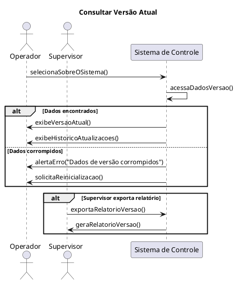
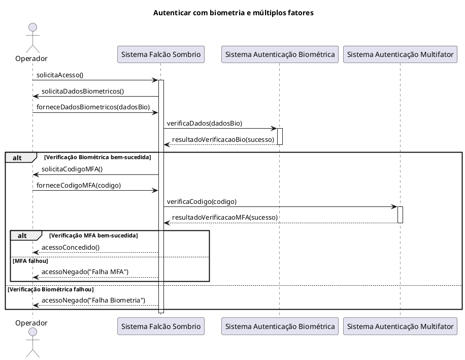
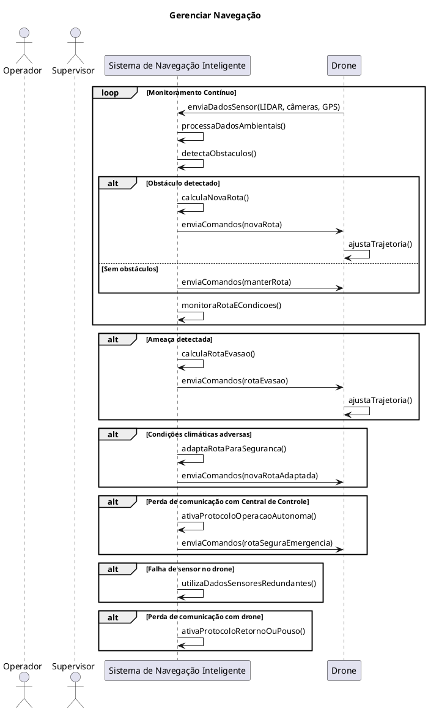
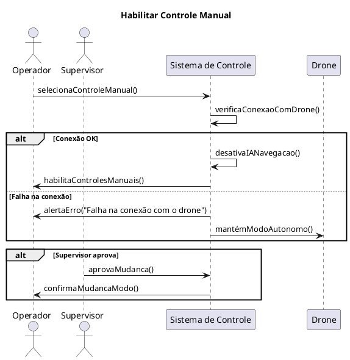
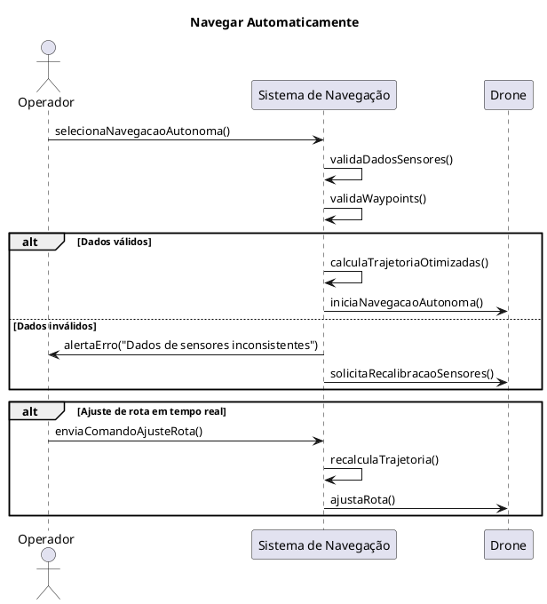
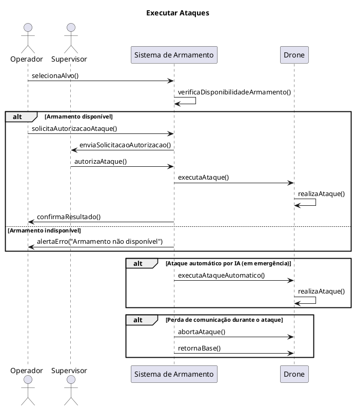

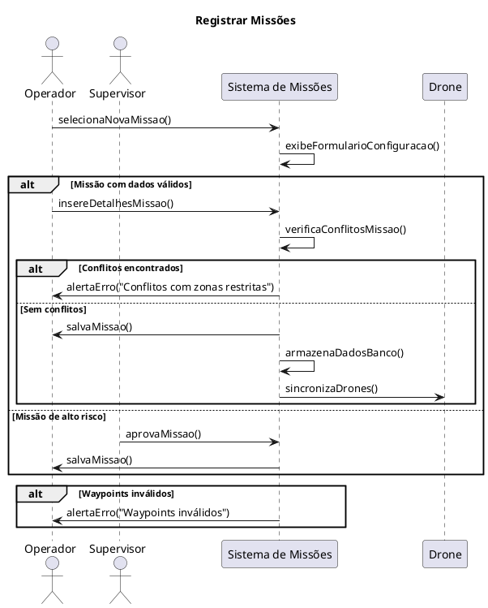
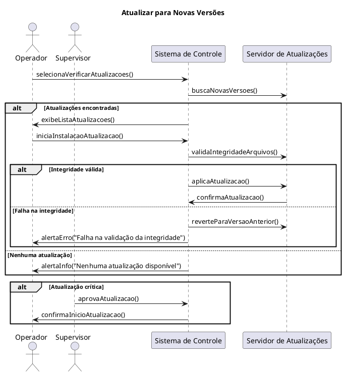
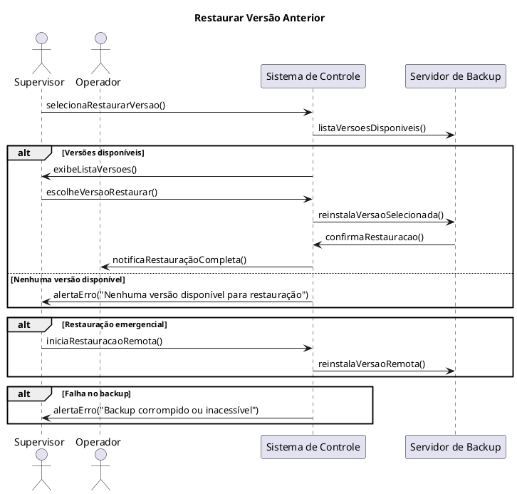
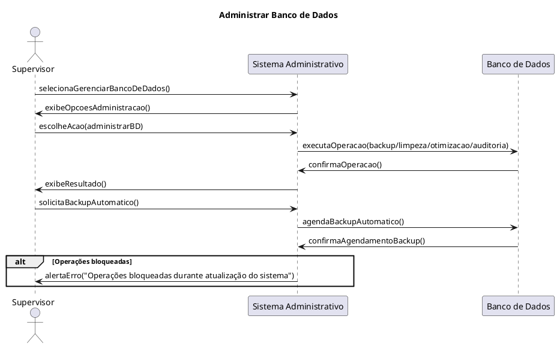
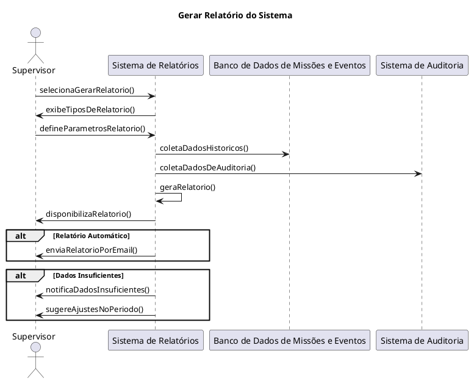
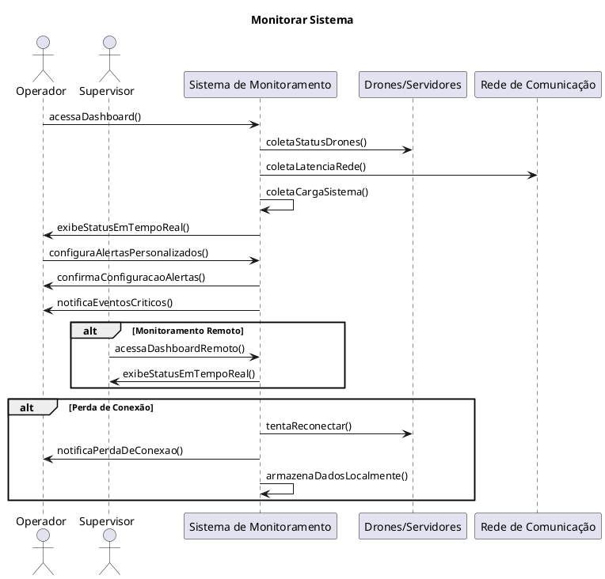
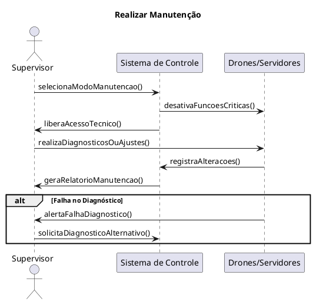
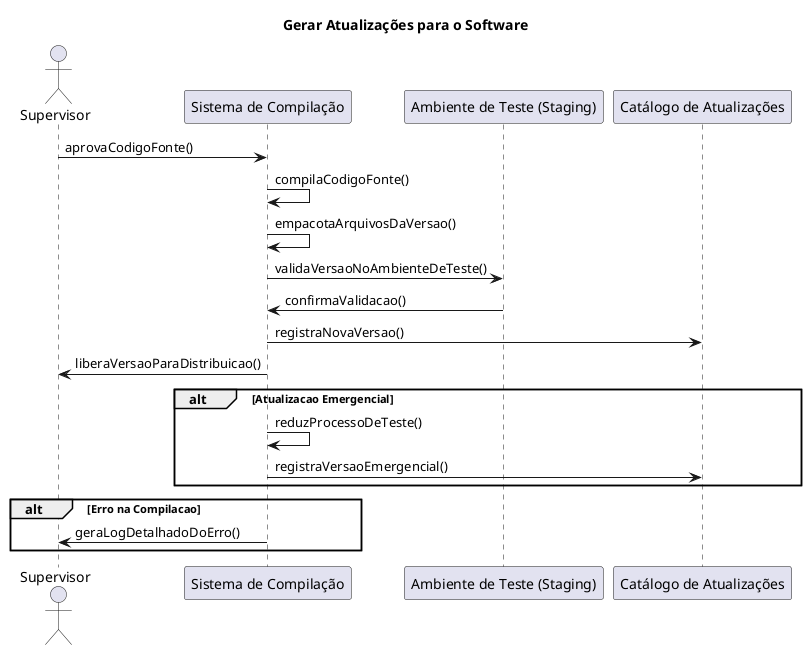

# Diagrama de Classes

[Diagrama Classes Principal](./diagrama_classes_principal.png)
[Subsistema Armamento](./diagrama_subsistema_armamento.png)
[Subsistema Autenticação](./diagrama_subsistema_autenticacao.png)
[Subsistema Monitoramento](./diagrama_subsistema_monitoramento.png)
[Subsistema Navegação](./diagrama_subsistema_navegacao.png)

# Diagrama de Estados

_&lt;Diagrama para permite modelar o comportamento interno de um determinado objeto, subsistema ou sistema global&gt;_

# Diagrama de Implantação

_&lt;Diagrama para exibir o relacionamento de hardware e software no projeto&gt;_

# Referências

_&lt;Lista de referências&gt;_
